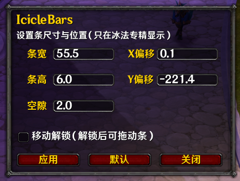
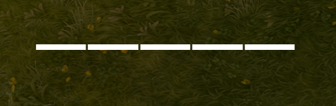
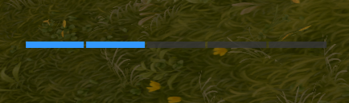
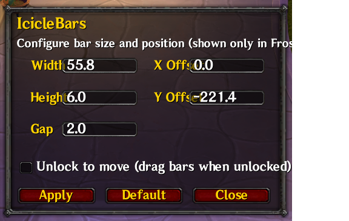

# IcicleBars

IcicleBars is a lightweight World of Warcraft Retail addon for Frost Mages. It shows your current Icicle stacks as a compact five-bar tracker and stays hidden outside Frost spec.

## Screenshots






## Features

- Displays `0` to `5` Icicles with a clear full-stack state
- Minimal five-bar layout for fast readability
- In-game options for size, spacing, position, and drag-to-move
- English (`enUS`, `enGB`) and Simplified Chinese (`zhCN`) support

## Installation

1. Download or clone this repository.
2. Make sure the folder is named `IcicleBars`.
3. Put it in:

```text
World of Warcraft/_retail_/Interface/AddOns/
```

4. Reload the game and enable `IcicleBars` if needed.

## Commands

Use any of these in game:

```text
/iciclebars
/icicle
/ib
```

## Configuration

The options window lets you adjust:

- Bar width and height
- Gap between bars
- X/Y position
- Unlock to drag the frame

Settings are saved in `IcicleBarsDB`.

## License

MIT. See [LICENSE](LICENSE).
